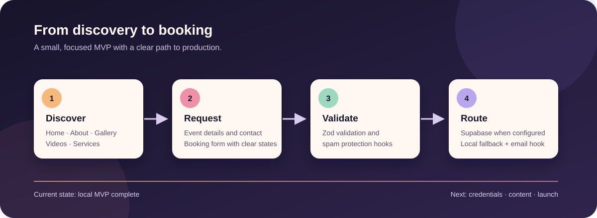

# Artist Booking Website

> A polished, mobile-first booking experience for an actor/musician — currently a work in progress.


This repository contains the first production-minded iteration of an artist portfolio and booking site. It brings together an expressive public-facing website, a validated booking flow, and integration points for Supabase, Resend, and Cloudflare Turnstile.

The local MVP is complete. Final artist content, production credentials, legal copy, media rights, and deployment are intentionally still open so they can be supplied and reviewed by the site owner.



## What is here

- Responsive public pages: home, about, gallery, videos, contact, and legal placeholders.
- Booking form with client/server validation, sanitization, loading states, and structured errors.
- Local JSON fallback for development, with Supabase persistence ready behind environment variables.
- Resend notification support and Cloudflare Turnstile hooks, both optional locally.
- SEO foundations including metadata, sitemap, robots, Open Graph, and structured data.
- A loop-engineering trail that records progress, decisions, verification, and human-owned blockers.

## Project map

```text
frontend/          Next.js application (App Router, UI, API routes)
supabase/          Database migrations
docs/              Architecture, verification, and conventions
loop-engineering/  MVP progress and loop-engineering plans
```

## Get started locally

### Prerequisites

- Node.js `20.x` LTS or newer
- npm

### Install and run

From the repository root:

```bash
make install
cp frontend/.env.example frontend/.env.local
make dev
```

Or run commands directly in `frontend/`:

```bash
cd frontend
npm install
cp .env.example .env.local
npm run dev
```

Open [http://localhost:3000](http://localhost:3000).

The app works without production credentials: booking requests are written to `frontend/data/booking-requests.json`, email delivery is skipped, and Turnstile is only enforced when its production configuration is present.

## Environment Variables

Copy `frontend/.env.example` to `frontend/.env.local` and fill in values when available. Never commit real secrets.

| Variable                         | Purpose                                       |
| -------------------------------- | --------------------------------------------- |
| `NEXT_PUBLIC_SITE_URL`           | Public site URL used for metadata and sitemap |
| `NEXT_PUBLIC_TURNSTILE_SITE_KEY` | Cloudflare Turnstile site key (public)        |
| `TURNSTILE_SECRET_KEY`           | Cloudflare Turnstile secret key (server only) |
| `SUPABASE_URL`                   | Supabase project URL                          |
| `SUPABASE_SERVICE_ROLE_KEY`      | Supabase service role key (server only)       |
| `RESEND_API_KEY`                 | Resend API key (server only)                  |
| `BOOKING_NOTIFICATION_TO`        | Booking notification recipient                |
| `BOOKING_NOTIFICATION_FROM`      | Verified Resend sender address                |

### Local development behavior

- Without Supabase credentials, booking requests are stored in `frontend/data/booking-requests.json`.
- Without Resend credentials, email notifications are skipped gracefully.
- Turnstile verification is required only in production when both Turnstile keys are configured.

## Verify the project

Run all automated checks and tests from the repository root:

```bash
make test
```

Or run individual checks inside `frontend/`:

```bash
cd frontend
npm run lint
npm run typecheck
npm run test
npm run format:check
npm run build
```

See `docs/verification.md` and `docs/manual_qa.md` for full verification guidance.

## Work-in-progress roadmap

### Complete locally

- [x] Public website structure and reusable UI foundation
- [x] Booking form, API route, validation, and local fallback storage
- [x] Supabase, Resend, and Turnstile integration points
- [x] SEO basics, legal placeholders, automated checks, and production build

### Still needs owner input

- [ ] Add the final artist name, biography, services, testimonials, and contact details.
- [ ] Replace placeholder images/videos and confirm media rights.
- [ ] Configure Supabase, Resend, and Turnstile credentials.
- [ ] Review and approve the Impressum and Privacy Policy.
- [ ] Connect Vercel, domain, DNS, and production environment variables.

See [`loop-engineering/mvp_progress.md`](loop-engineering/mvp_progress.md) for the live status and [`loop-engineering/human_inputs_needed.md`](loop-engineering/human_inputs_needed.md) for the handoff checklist.

## Optional Python environment

The website itself runs on Node.js. A Python virtual environment is optional and only needed if you add Python scripts or tooling alongside this project.

Create and activate a Python 3.11 `.venv` on Windows:

```powershell
py -3.11 -m venv .venv
.\.venv\Scripts\Activate.ps1
python --version
```

Install packages when needed:

```powershell
pip install -r requirements.txt
```

Deactivate when finished:

```powershell
deactivate
```

## Image guidance

- Use optimized JPEG or WebP images where possible.
- Recommended hero image size: `1600x1200` or similar 4:3 aspect ratio.
- Recommended gallery images: `1200x900` or larger with consistent aspect ratios.
- Provide meaningful alt text and captions in `frontend/content/site.ts`.
- Replace placeholder Unsplash URLs with final licensed media before production.

## Frontend structure

```text
frontend/
  app/           Next.js routes and API
  components/    Reusable UI components
  content/       Placeholder artist and site content
  lib/           Shared utilities and server integrations
  styles/        Global styles
  tests/         Unit tests
  public/        Static assets
```

## Deployment prerequisites

- Vercel project connected to this repository with root directory set to `frontend`
- Supabase project with `booking_requests` schema applied from `supabase/migrations/`
- Resend account with verified sender domain
- Cloudflare Turnstile site configured for production domain
- Final artist content, media rights, and legal page approval

## Loop engineering

This project is designed for iterative, transparent delivery. Progress and blockers are tracked in:

- `loop-engineering/mvp_progress.md`
- `loop-engineering/human_inputs_needed.md`
